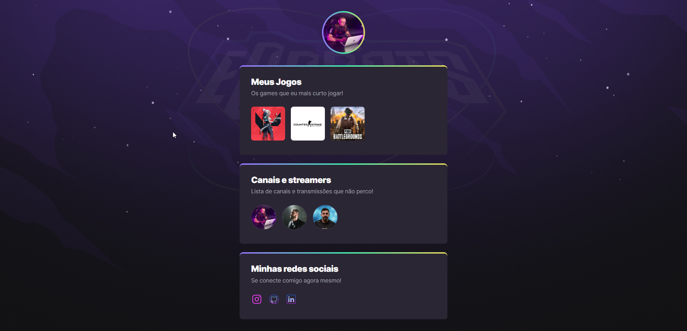

# NLW eSports - Trilha Explorer

Esse é um projeto super legal que desenvolvi durante o evento **NLW eSports**, realizado pela [Rocketseat](https://github.com/Rocketseat) 🚀. 

🔗 [Para ver o resultado, é só clicar aqui](https://github.com/jonasnoliveira/nlw-esports-explorer/). 🔗

## 📋 Conceito

A temática dessa **Next Level Week** era eSports, e por isso, o desafio da trilha **Explorer** era criar uma página com os games e streamers preferidos do usuário. 🎮

## 🛠️ Tecnologias Utilizadas
Apesar de simples, esse projeto me ajudou muito a aprofundar em **HTML e CSS**, além de ter ficado muito bonito 💻.

As aulas e didática do grande [@maykbrito](https://github.com/maykbrito) foram o elemento chave para me ajudar a entender conceitos que antes pareciam complexos, como as *animations* e as *transitions* do CSS. 🧠

